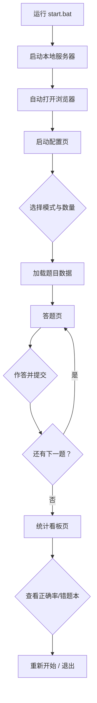

# 试题自测程序 — 产品需求文档

## 1. 产品概述

基于JSON题库数据的本地HTML试题自测应用，支持顺序/随机练习模式、题目数量选择、正确率统计与排序、错题本累计统计，数据持久化保存至本地存储。通过BAT脚本一键启动并自动打开浏览器。

目标用户：需要反复刷题、追踪正确率与错题的学习者。

## 2. 核心功能

### 2.1 功能模块

1. **启动配置页**：选择练习模式（顺序/随机）、设置题目数量（自定义/全部）、选择章节范围
2. **答题页**：展示题目与选项，支持单选/多选/判断题作答，提交后即时反馈正误与解析
3. **统计看板页**：每道题正确率统计（支持升序/降序排序）、错题本（累计错误次数）、练习历史概览

### 2.2 页面详情

| 页面名称 | 模块名称 | 功能描述 |
|---------|---------|---------|
| 启动配置页 | 模式选择 | 顺序模式 / 随机模式切换 |
| 启动配置页 | 数量设置 | 输入框自定义题目数，或切换“全部题目” |
| 启动配置页 | 章节筛选 | 多选章节范围（基于JSON中的chapter字段） |
| 答题页 | 题目展示 | 显示题干、选项（单选/多选/判断） |
| 答题页 | 作答交互 | 选择答案后提交，显示正确/错误状态 |
| 答题页 | 解析展示 | 显示正确答案与简要解析（如有） |
| 答题页 | 进度导航 | 题号进度条、上一题/下一题/跳题 |
| 统计看板页 | 正确率统计 | 每道题历史正确率，支持升序/降序排序 |
| 统计看板页 | 错题本 | 累计错误次数统计，支持筛选只看错题 |
| 统计看板页 | 数据管理 | 重置统计数据、导出/导入本地数据 |

## 3. 核心流程

用户打开BAT文件 → 启动本地HTTP服务器 → 自动打开浏览器 → 加载启动配置页 → 选择模式与数量 → 进入答题页 → 逐题作答并即时反馈 → 完成练习后进入统计看板 → 查看正确率与错题本 → 可选择重新开始或退出

## 4. 用户界面设计

### 4.1 设计风格（Material 3 Expressive）

- **色彩体系**：
  - 主色：深紫靛蓝 `#6750A4`（用于主按钮、激活状态）
  - 次色：玫瑰粉 `#B3261E`（用于错题标记、警告状态）
  - 表面色：动态浅色背景 `#FEF7FF`，卡片 `#FFFFFF` 带轻微阴影
  - 成功色：绿色 `#4CAF50`，错误色：红色 `#F44336`
- **按钮样式**：圆角胶囊形（pill shape），带涟漪效果，主按钮填充色，次按钮描边
- **字体与字号**：
  - 标题：Google Fonts `Noto Sans SC`，32px/24px/20px 三级标题
  - 正文：16px，行高1.5
- **布局风格**：卡片式布局，顶部应用栏（App Bar），内容区居中最大宽度800px，移动端自适应
- **图标/动效**：Material Symbols 图标，页面切换使用淡入滑动动画，按钮点击有涟漪反馈

### 4.2 页面设计概述

| 页面名称 | 模块名称 | UI元素 |
|---------|---------|--------|
| 启动配置页 | 模式选择 | 两个卡片式单选按钮（顺序/随机），选中时主色填充 |
| 启动配置页 | 数量设置 | 数字输入框 + 开关切换“全部题目” |
| 启动配置页 | 章节筛选 | 多选Chip组件列表 |
| 启动配置页 | 开始按钮 | 底部固定宽主按钮“开始练习” |
| 答题页 | 题目卡片 | 大圆角白色卡片，题干加粗，选项垂直排列 |
| 答题页 | 选项 | 单选/多选圆形选择器，选中后主色填充 |
| 答题页 | 反馈区 | 提交后底部展开正确/错误提示条 |
| 答题页 | 进度条 | 顶部线性进度条，显示当前题号/总题数 |
| 统计看板页 | 正确率列表 | 每行显示题号、题干摘要、正确率进度条、排序按钮 |
| 统计看板页 | 错题本 | 红色标记错题，显示累计错误次数徽章 |
| 统计看板页 | 排序控制 | 下拉选择或按钮组：正确率从高到低/从低到高 |

### 4.3 响应式设计

- 桌面端：内容区最大宽度800px，居中显示，左右留白
- 平板端：内容区宽度90%，卡片双列布局变为单列
- 移动端：全宽布局，底部固定操作按钮，字体适当缩小

### 4.4 动画与交互

- 页面加载：内容区从下方滑入（translateY + opacity），stagger延迟100ms
- 选项选择：点击后圆形选择器缩放动画（scale 0.8 → 1.0）
- 提交反馈：底部snackbar滑入，正确绿色/错误红色背景
- 进度条：平滑过渡动画（width变化 300ms ease-out）
- 排序切换：列表项重新排列时使用FLIP动画过渡

## 5. 数据持久化需求

- 使用浏览器 `localStorage` 保存以下数据：
  - `quiz_stats`：每道题的作答记录（总次数、正确次数、错误次数）
  - `quiz_history`：每次练习的摘要（时间、模式、数量、正确率）
- 提供“重置数据”按钮清空所有统计
- 提供“导出数据”生成JSON文件下载，“导入数据”从JSON文件恢复
