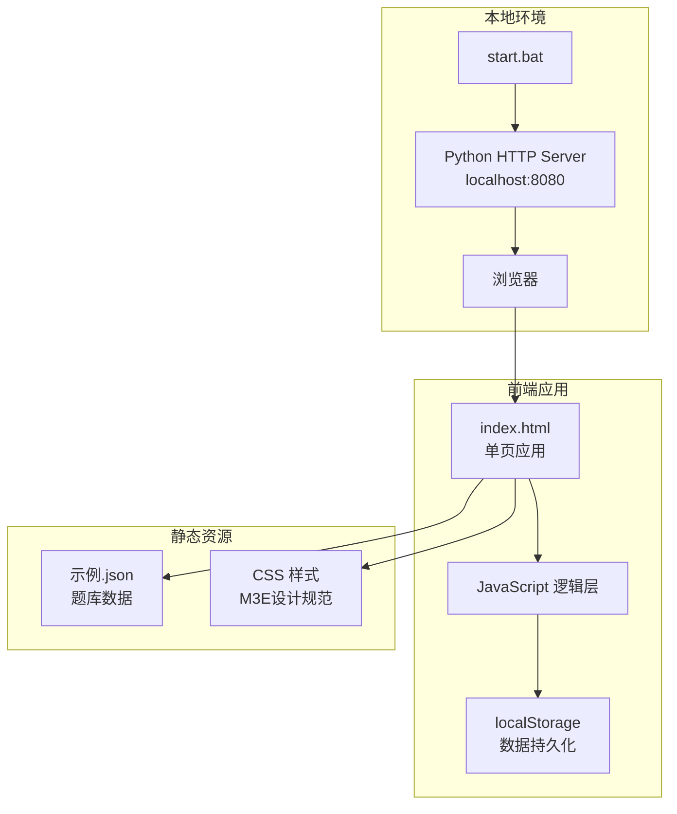

# 试题自测程序 — 技术架构文档

## 1. 架构设计



## 2. 技术描述

- **前端**：纯 HTML5 + CSS3 + Vanilla JavaScript（无框架依赖，单HTML文件即可运行）
- **样式**：自定义 CSS 实现 Material 3 Expressive 设计规范，使用 CSS 变量管理主题色
- **本地服务器**：Python 内置 `http.server` 模块（通过 `start.bat` 启动）
- **数据存储**：浏览器 `localStorage`
- **启动脚本**：Windows Batch 脚本（`.bat`），自动启动服务器并调用默认浏览器

## 3. 路由定义（页面切换）

| 页面标识 | 用途 |
|---------|------|
| `#setup` | 启动配置页（默认） |
| `#quiz` | 答题页 |
| `#stats` | 统计看板页 |

采用 Hash 路由方式，通过 `window.location.hash` 切换页面，无后端路由依赖。

## 4. 数据模型

### 4.1 JSON 题库结构

```json
[
  {
    "chapter": "章节名称",
    "questions": [
      {
        "global_id": "Q001",
        "id": 题号,
        "type": "单选题/多选题/判断题",
        "question": "题目内容",
        "options": {"A": "选项A", "B": "选项B", ...},  // 判断题无此字段
        "answer": "正确答案"
      }
    ]
  }
]
```

### 4.2 localStorage 数据结构

```javascript
// quiz_stats 键
{
  "question_stats": {
    "chapterId_questionId": {
      "total_attempts": 10,
      "correct_count": 7,
      "wrong_count": 3
    }
  }
}

// quiz_history 键
{
  "sessions": [
    {
      "date": "2026-05-27T10:00:00",
      "mode": "random",
      "total_questions": 20,
      "correct_count": 15,
      "accuracy": 0.75
    }
  ]
}
```

## 5. 核心模块设计

### 5.1 模块划分

| 模块 | 职责 |
|-----|------|
| `DataLoader` | 加载并解析 `示例.json`，扁平化题目列表 |
| `QuizEngine` | 管理当前练习状态（当前题号、用户答案、模式逻辑） |
| `StatsManager` | 统计计算、排序、localStorage 读写 |
| `UIRenderer` | 渲染各页面 DOM，处理页面切换动画 |
| `StorageManager` | 封装 localStorage 操作，支持导入/导出 JSON |

### 5.2 关键算法

- **随机模式**：Fisher-Yates 洗牌算法打乱题目顺序
- **正确率排序**：根据 `correct_count / total_attempts` 计算，支持升序/降序
- **错题筛选**：过滤 `wrong_count > 0` 的题目，按 `wrong_count` 降序排列

## 6. 启动脚本设计（start.bat）

```batch
@echo off
cd /d "%~dp0"
start python -m http.server 8080
timeout /t 2 >nul
start http://localhost:8080
```

功能：
1. 切换到脚本所在目录
2. 后台启动 Python HTTP 服务器（端口8080）
3. 等待2秒确保服务器启动
4. 使用系统默认浏览器打开应用地址

## 7. 文件结构

```
Mai-Tesuto/
├── 示例.json          # 题库数据源
├── index.html         # 主应用（单页应用，含HTML/CSS/JS）
├── start.bat          # 启动脚本
└── .trae/
    └── documents/
        ├── PRD.md
        └── Technical-Architecture.md
```

## 8. 浏览器兼容性

- Chrome 90+
- Edge 90+
- Firefox 88+
- 支持 ES6+、CSS Variables、localStorage
